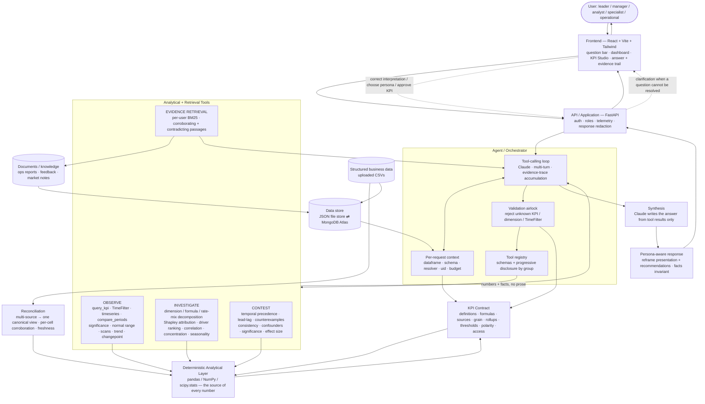

<div align="center">

# BusinessIntelligence.ai

### [Live Demo](https://businessintelligence-bbt.vercel.app)

**An evidence-backed KPI investigation system — an agent that answers business questions from your own data and documents, and shows its working.**

Dashboards tell you *what* happened. This tells you what changed, whether it matters, what most likely explains it, **what contradicts that explanation**, and what to do next — with every number computed deterministically and every claim traceable to evidence.

Accenture Innovation Challenge 2026 · Prototype submission

</div>

---

## What it is

A question-driven analytics agent for business KPIs. A user uploads their metrics (one or more CSVs) and any written material (operations reports, customer feedback, market notes), then asks a plain-language question — *"what was revenue in all odd-numbered years?"*, *"is this quarter's margin dip normal?"*, *"what factors are affecting my profit?"*, *"what should I be worried about right now?"*

The agent interprets the question, decides which analytical tools to run, pulls real numbers from a deterministic analysis layer, retrieves supporting and contradicting passages from the documents, stress-tests its leading explanation, and writes the final answer itself — with a collapsible evidence trail behind it.

### The business problem

Answering "why did this KPI move, and can I trust the explanation?" takes an analyst hours across dashboards, spreadsheets, ops reports and customer feedback. Many businesses have no analyst. And the easiest mistake is to accept the first explanation that sounds convincing — usually the best-documented one, which is not the same as the true one.

### Core value proposition

- **Numbers you can trust** — every KPI value, significance test, driver contribution and correlation is computed by a deterministic pandas/NumPy layer, never by the language model.
- **Explanations that have been challenged** — the leading cause is tested for temporal precedence, cross-sectional consistency, counterexamples, reverse causation and contradictory documents before it is offered.
- **Governed semantics** — every KPI resolves through a versioned, user-approved **KPI Contract**: one definition, one formula, one grain, known access rules.
- **Persona-aware delivery** — the same facts, delivered differently to a leader, a manager, an analyst, a domain specialist or an operational user.

---

## Core Capabilities

- **Agentic investigation** — a tool-calling loop interprets the question, selects tools, runs analysis, gathers evidence, validates, and synthesises the answer.
- **General querying** — arbitrary time scopes (ranges, predicates like "odd years", trailing-N, group-by, top-N, multi-dimension slices) via a `TimeFilter` abstraction and a single generic query engine.
- **KPI Contract** — governs KPI definitions, formulas, source fields, grain, rollup rules, thresholds, polarity and access restrictions; versioned and human-approved.
- **Deterministic analytical layer** — significance, driver decomposition, attribution, correlation, trend, seasonality, concentration and changepoint detection.
- **Evidence retrieval** — per-user BM25 index over uploaded documents; retrieves both corroborating and contradicting passages, quoted verbatim with source and section.
- **Contest / validation** — adversarial checks that can cap or demote an explanation the evidence does not survive.
- **Multi-source reconciliation** — stitches several same-vocabulary CSVs into one canonical business view, per cell, refusing to guess when sources disagree.
- **Personas & roles** — five presentation personas; two authorization roles with server-side field redaction.
- **Telemetry** — per-request model calls, tokens, latency and estimated cost.

---

## Architecture

The system is layered so that **the LLM orchestrates and writes, and a deterministic layer produces every business number.**

- **Frontend (React + Vite + Tailwind)** — question bar, dashboard, KPI Studio, investigation view with a single answer plus a collapsible evidence trail.
- **API / application layer (FastAPI)** — auth, roles, request telemetry, response redaction, and the entry points for questions, single stages, the dashboard and the KPI Contract.
- **Agent / orchestrator** — receives the raw question, holds a per-request context (dataframe, schema, resolver, user), runs the tool-calling loop against Claude, accumulates the evidence trace, and returns `{answer, evidence[], kpis_used, periods_used, engine}`.
- **Tool layer** — a registry of typed analytical and retrieval tools grouped into **Observe** (relevance, retrieval, noise filtering), **Investigate** (produce explanations) and **Contest** (verify explanations), with a validation airlock that rejects hallucinated KPI keys, unknown dimensions and malformed time filters before execution.
- **KPI Contract layer** — the one sanctioned path onto a dataset's KPI semantics; a formula AST, a relation graph, a dimension-member catalogue and a non-blocking relevance search.
- **Deterministic analysis engines** — pandas/NumPy (`observe`, `analysis`, `drivers`, `metrics`, `signals`) plus `scipy.stats` for p-values, CIs and bootstrapping.
- **RAG retrieval** — heading-aware chunking and a per-user BM25 index.
- **Reconciliation** — builds one canonical dataframe from multiple sources with per-source freshness and per-cell corroboration.
- **Persona layer** — reframes the finished findings for the reader without being able to alter what the evidence says.
- **Data store** — document-shaped JSON file store by default, swappable to MongoDB Atlas with no code change.



---

## Agentic Workflow

The agent runs a **tool-use loop**: the question and a seed of dataset facts (`describe_dataset` + `list_kpis`) go into the system prompt; the model then calls tools and re-plans on their results until it can answer.

- **The agent** decides *which* tools to call and in *what order*, judges when a finding needs stress-testing, decides which KPIs are relevant when none is named, and writes all prose.
- **The tools** return only numbers and facts — never a pre-written sentence. Deterministic math lives entirely inside tool implementations.

Progressive disclosure keeps the tool list legible: orientation and retrieval tools are always loaded; the Investigate and Contest groups are admitted once the model commits to an explanatory question.

| Component / Tool group | Purpose | Method / Technology |
|---|---|---|
| Agent loop | Interpret question, select & sequence tools, synthesise answer | Anthropic Claude, multi-turn tool use, evidence-trace accumulation |
| Validation airlock | Stop hallucinated arguments before execution | Structured, recoverable errors against contract keys / dimensions / `TimeFilter` |
| KPI Contract API | The one path onto KPI meaning and values | Read-only facade over the compiled contract; resolver bound once |
| Formula AST / relation graph | What a KPI is built from, and what relates to it | Parsed formula AST (signed terms, numerator/denominator, transitive expansion) |
| Dataset orientation | Tell the agent what exists | `describe_dataset`, `list_kpis`, `list_dimensions`, `list_dimension_members` |
| KPI relevance | Resolve which KPI(s) matter when none is named | Non-blocking ranked search by name / semantic tag / concept alias / definition |
| `query_kpi` + `TimeFilter` | Any value over any time scope, filter, group-by, sort, top-N | Single aggregation primitive over arbitrary row slices |
| Timeseries & comparison | Values over quarter / month / week; arbitrary A/B | Grain-aware series; period-over-period and custom baselines |
| KPI significance | Detect meaningful movement | Robust z vs the KPI's own history (median / MAD), seasonality-aware, small-sample corrected |
| Normal range / materiality | "Is this unusual *for us*" without a comparison | Robust sigma control band + minimum-material-change gate |
| Discovery scans | Where to start when nothing is named | Loop KPIs → significance; anomaly sweep; dimension outliers; worst-first ranking (polarity-aware) |
| Dimension decomposition | Where a change came from | Delta contribution; rate/mix split for ratio KPIs; nested drill |
| Formula decomposition | Split a KPI by its own formula components | Attribution arithmetic over the formula AST (generalised price × volume) |
| Driver Ranking | Find meaningful drivers | Over-indexing (contribution ÷ share of baseline) + exact Shapley attribution |
| Correlation | What moved with the KPI | Cross-sectional and time-series correlation; one-to-many matrix sweep; minimum-n guard |
| Concentration | "80% of revenue from 3 accounts" | HHI / Gini / top-k share |
| Trend & seasonality | Getting better or worse; seasonal vs problem | Robust slope + persistence; ACF / periodogram seasonal index |
| Temporal validity | Did the cause precede the effect | Weekly onset detection + lead/lag cross-correlation on differenced series |
| Cross-sectional consistency | Does the relationship hold everywhere | Per-member relationship strength; counterexample search |
| Statistical adequacy | Is the evidence strong enough | p-values, confidence intervals, effect size, bootstrap (`scipy.stats`) |
| Confounders / competing explanations | Is it spurious or explained by something else | Partial correlation; detrending; same evidence basis across candidates |
| Evidence Retrieval | Supporting and contradicting text | Per-user BM25 index, heading-aware chunks, absolute relevance scoring |
| Reconciliation | One business view from many sources | Per-cell corroboration, roll-up only, freshness by declared cadence |
| Persona reframing | Fit the answer to the reader | Prompt-driven reframing constrained to the evidence-implicated drivers |

---

## Investigation Flow

```
Question
  → interpretation (KPI + period resolved against the KPI Contract; a question that
    cannot be resolved returns a clarification, not an answer for something adjacent)
  → orientation & tool selection (seeded with describe_dataset + list_kpis)
  → OBSERVE — retrieve values, filter noise, judge significance and normal range,
    scan the KPI space when nothing is named
  → INVESTIGATE — decompose the movement, rank drivers, correlate candidates,
    generate competing explanations
  → EVIDENCE — retrieve corroborating and contradicting passages from the documents
  → CONTEST — stress-test the leading explanation: temporal precedence,
    cross-sectional consistency, counterexamples, reverse causation, statistical adequacy
  → confidence — evidence strength, presented as evidence-based confidence, never a probability;
    close explanations are reported as close rather than resolved
  → recommendation — actions the model derives from what it found, tied to the evidence
  → response — a single written answer plus a collapsible evidence trail, reframed for the
    reader's persona
```

Simple questions (Tier 1–2: a value, a range, a top-N) terminate in one or two tool calls. "Is this normal?" often terminates inside OBSERVE — *"that's seasonal, ignore it"* is a correct answer that needs no explanation. Multi-factor and open-ended questions bounce between Observe, Investigate and Contest non-linearly until the agent converges.

---

## Analytical Intelligence

| Capability | Principal method |
|---|---|
| Significance | Robust z (median / MAD) vs the KPI's own history, narrowed to same-quarter transitions where history allows, small-sample corrected |
| Normal range | Robust-sigma control band + monitoring threshold |
| Driver attribution | Over-indexing + exact Shapley dimension attribution |
| Rate vs mix | Ratio-KPI decomposition (`rate = wₐ·Δr`, `mix = r_base·Δw`) |
| Formula attribution | Signed-term walk of the parsed formula AST |
| Concentration | HHI / Gini / top-k share |
| Trend | Robust slope + direction + persistence + sample adequacy |
| Seasonality | ACF / periodogram seasonal index; seasonal-norm comparison |
| Changepoint / onset | MAD-band + persistence onset detection |
| Temporal analysis | Onset comparison + lead/lag cross-correlation on first-differenced weekly series |
| Correlation | Pearson (cross-sectional + time-series), one-to-many matrix, minimum-n guard |
| Statistical adequacy | p-value, confidence interval, effect size, bootstrap (`scipy.stats`) |
| Confounder control | Partial correlation; spurious-correlation / detrending checks |
| Evidence | Per-user BM25 retrieval, corroborating and contradicting |
| Validation | Counterexample search, cross-sectional consistency, reverse-causation screen |
| Multi-source | Per-cell reconciliation, roll-up-only alignment, cadence-based freshness |

---

## Trust & Governance

- **KPI Contract** — one versioned, human-approved document per (user, dataset). Defines each KPI's formula, source fields, unit, aggregation kind, time grain, valid rollups, polarity and access. Nothing silently resolves an ambiguity: it records a `ConflictFlag` and refuses approval until a human decides.
- **Deterministic numerical truth** — the language model never computes a business figure. KPI values, deltas, significance, driver contributions, correlations, p-values and thresholds all come from the pandas/NumPy/`scipy.stats` layer via the contract resolver.
- **Evidence and citations** — every document claim is quoted verbatim with its source and section; retrieval relevance is scored absolutely, not relative to a query's best hit.
- **Confidence** — reported as evidence strength, not probability; two close explanations are reported as close.
- **Contradiction testing** — Contest actively queries for passages that argue *against* the leading hypothesis and re-classifies them as a skeptical reviewer.
- **Abstention** — a question that cannot be resolved to a KPI the dataset measures, or names a period it does not hold, returns a clarification request rather than an answer to a nearby question.
- **Sparse / incomplete data** — `fillna(0.0)` on metric columns means a missing value can look like a real zero; this is surfaced so the agent can caveat. Statistical tools return a typed `insufficient` status rather than a fabricated number when n is too small.
- **Source reconciliation** — where two sources disagree about the same cell, the value is left missing and a blocking conflict is raised for a human; sources are never added together.
- **Authorization / access control** — Firebase ID-token auth (with a demo-login fallback); analyst-only fields are removed from the API response for other roles server-side, not hidden in the client.
- **Auditability** — investigations are persisted with their full result and evidence trail; the KPI Contract is versioned.
- **Telemetry** — per-request model calls, token counts, latency and estimated cost, aggregated via a request-scoped context.

> **LLM → orchestration, hypothesis and narrative reasoning.**
> **Deterministic layer → business numbers and quantitative analysis.**

---

## Personas & Security

**Five personas** (`business_analyst` — the neutral default, `business_manager`, `business_leader`, `domain_specialist`, `operational_user`). A persona changes only two things: how the explanation is written, and what the reader is advised to do (analytical follow-ups vs operational interventions vs strategic decisions vs domain-technical actions vs immediate shift-level actions).

**Why the facts stay invariant** — which explanations ranked where, how confident each is, what supports or contradicts it, and whether causality can be claimed are all computed *before* any persona is consulted and passed through untouched. Reframing may change emphasis, depth, vocabulary and the recommended action; it may not introduce a driver the evidence did not establish, and any recommendation that reaches outside the implicated drivers is dropped.

**Authorization roles** — `data_analyst` and `business_leader`, chosen at sign-up and changeable in Settings. Persona defaults from the role but is not authorization. The analyst view adds the significance method and parameters, full driver tables, the evidence ledger behind every confidence score, per-member consistency tables and a retrieval inspector — and those fields are stripped from the response for non-analysts.

---

## Data & Integrations

- **Structured data** — one or more CSVs with a `date` column, at least one metric column, and any dimension columns. Unknown text columns become dimensions; unknown numeric columns become candidate KPIs. Multiple same-vocabulary CSVs are reconciled into one canonical view.
- **Documents** — Markdown / text / PDF business material (operations reports, customer feedback, market intelligence, management commentary, sales reviews, logistics logs, pricing notes), chunked heading-aware and BM25-indexed per user.
- **Reconciliation** — per-cell corroboration across sources; roll-up-only time alignment; per-source freshness from declared or observed refresh cadence (never inferred from row grain).
- **Storage** — document-shaped JSON file store by default; set `DB_BACKEND=mongo` with `MONGODB_URI` to move to MongoDB Atlas with no code change.
- **LLM integration** — Anthropic Claude (`anthropic` SDK); model set by `ANTHROPIC_MODEL`. With no `ANTHROPIC_API_KEY`, LLM-dependent framing and narrative degrade to a deterministic reasoner.
- **Auth integration** — Firebase Admin (ID-token verification) with an `auto` mode that falls back to local demo login when no credentials are present.

No other external or enterprise integrations are implemented.

---

## Frontend / Backend / Agent Layers

| Layer | Role | Main Components |
|---|---|---|
| Frontend | Ask questions, correct interpretation, read the answer and evidence, manage data and the KPI Contract | `pages/` (Dashboard, InvestigationPage, KpiStudioPage, DataPage, DocumentsPage, HistoryPage, SettingsPage, AuthPage) · `components/` (QuestionBar, HypothesisCard, EvidencePanel, ConfidenceMeter, ReasoningTrail, charts) · `context/` (Auth + role, Theme) · `demo/` (self-contained walkthrough) |
| API / Backend | Auth, roles, orchestration entry points, telemetry, response redaction, persistence | `main.py` · `api/` (routes for auth, data, KPI contract, analysis, system; `redact.py`) · `services/` (`dataset_service`, `pipeline`, `reconciliation`, `telemetry`) · `db/` (json_store ⇄ mongo_store, repositories) · `auth/firebase_auth.py` |
| Agent | Interpret question, run the tool loop, validate arguments, accumulate the evidence trail | `agent/` (`contract_api`, `formula`, `relations`, `errors`; loop / registry / context / `timefilter` / `tools/*` per the integration plan) · `query/` (`understanding`, `grounding`, `periods`) |
| Analysis & retrieval | Produce every number; retrieve every quote | `engines/` (`observe`, `analysis`, `drivers`, `metrics`, `signals`, `driver_graph`, `hypotheses`, `investigate`, `contest`, `act`) · `kpi/` (`contract`, `resolver`, `library`, `profiling`, `screening`, `service`) · `rag/` (`extract`, `chunker`, `index`, `retriever`) · `llm/` (`client`, `prompts`) · `personas/` (`profiles`, `reframe`) |

---

## Project Structure

```
backend/
  app/
    main.py                 FastAPI application
    config.py               env-driven settings
    deps.py                 auth + role dependencies
    agent/                  agentic layer — contract facade, formula AST, relation graph,
                            typed errors; tool loop / registry / context / TimeFilter / tools
    api/                    routes: auth · data · kpi · analysis · system; role redaction
    auth/                   Firebase ID-token verification (+ demo mode)
    db/                     document store: base · json_store · mongo_store · repositories
    engines/                deterministic analysis — observe · analysis · drivers · metrics ·
                            signals · driver_graph · hypotheses · investigate · contest · act
    kpi/                    KPI Contract — models · resolver (formula AST) · library ·
                            profiling · screening · service · explanation
    llm/                    Anthropic client + system prompts
    query/                  question understanding · grounding · period parsing
    rag/                    extract · chunker · index (BM25) · retriever
    personas/               five persona profiles + evidence-constrained reframing
    services/               dataset loading · pipeline · reconciliation · telemetry
  tests/                    engine, contract, Shapley, resolver-propagation, acceptance suites
frontend/
  src/
    pages/                  dashboard · investigation · kpi studio · data · documents · history · settings
    components/             question bar · hypothesis cards · evidence · confidence · charts · kpi editor
    context/                auth (Firebase + role) · theme
    demo/                   self-contained demo walkthrough
    lib/                    api client · firebase · formatting
sample_data/                retail / hospital / school samples · multi-source set · document corpus · format reference
scripts/                    sample-data generators · headless pipeline runner · UI preview builder · RCA validator
docs/                       ARCHITECTURE · API_CONTRACT · KPI_CONTRACT · RANKING · FIREBASE_SETUP · DEMO_SCRIPT · TASK_BOARD
```

---

## Running Locally

Two terminals. **No Firebase project and no API key are required to run it.**

### Backend

```bash
cd backend
python3 -m venv .venv && source .venv/bin/activate    # Windows: .venv\Scripts\activate
pip install -r requirements.txt
cp .env.example .env
uvicorn app.main:app --reload --port 8000
```

API docs: <http://localhost:8000/docs>

### Frontend

```bash
cd frontend
npm install
cp .env.example .env
npm run dev
```

App: <http://localhost:5173>

### Demo path

1. Create an account (**Data Analyst** for the statistical layer, **Business Leader** for the decision view; without Firebase keys, any email logs in).
2. **Business data → Load sample company** — weekly rows across 14 quarters, four dimensions, sixteen metrics.
3. **Documents → Load sample documents** — seven business documents.
4. **Dashboard** — choose **2026 / Q2**; revenue is −17.2% and flagged as a meaningful signal.
5. Ask a question and walk the answer and its evidence trail.

Headless: `python3 scripts/run_pipeline_demo.py` runs an investigation end to end and prints the result.

### Key configuration

| Variable | Default | Effect |
|---|---|---|
| `DB_BACKEND` | `json` | `json` = local file store · `mongo` = MongoDB Atlas (`MONGODB_URI`) |
| `AUTH_MODE` | `auto` | `firebase` verifies ID tokens · `demo` local login · `auto` picks by credentials |
| `ANTHROPIC_API_KEY` | — | Empty runs the deterministic reasoner; the investigation still completes |
| `ANTHROPIC_MODEL` | `claude-sonnet-4-5` | Reasoning model id |
| `ANOMALY_Z_THRESHOLD` | `2.0` | Robust z above which a change is statistically unusual |
| `MIN_MATERIAL_CHANGE_PCT` | `3.0` | Changes below this are never called meaningful |
| `SOURCE_AGREEMENT_TOLERANCE_PCT` | `0.5` | Cross-source difference within this is corroboration, not disagreement |

---

## Testing

```bash
# Backend + agent + analytical layer (no network, no API key)
cd backend
python3 -m unittest discover -s tests -t .        # or: pytest

# Acceptance / tier eval suite
pytest tests/acceptance

# Root-cause validation harness
python3 scripts/validate_rca.py
```

The suite covers the parts where being wrong would be invisible: KPI values match a plain pandas `groupby`; ratio KPIs are computed from summed components; driver contributions and deltas sum exactly; the planted anomaly is detected and a quiet quarter is not; robust z stays plausible on small samples; the formula AST recovers signed components field-set containment gets wrong; a contract-only ratio KPI does not fall through to `df[key].sum()`; the well-documented supply hypothesis is still capped because the KPI moved first; reverse-causation risk is penalised; no hypothesis claims proven causation; the analyst response carries the evidence ledger and the leader response does not; one user cannot see another user's data. Frontend has no automated test suite (`vite build` is the check).

---

## Architecture Principles

- **Deterministic quantitative truth** — no business number is produced by a language model.
- **Governed KPI semantics** — every KPI resolves through one versioned, human-approved contract.
- **Agentic orchestration over analytical tools** — the model chooses and sequences tools; the tools do the math and return only facts.
- **Evidence before conclusions** — a claim is offered only with the passages and numbers behind it.
- **Challenge before recommendation** — the leading explanation is stress-tested before it is acted on; Investigate asks *"could this be the cause?"*, Contest asks *"what would disprove it?"*.
- **Explicit uncertainty** — confidence is evidence strength, not probability; close calls are reported as close.
- **Abstention over guessing** — an unresolvable question returns a clarification, not an answer to a nearby one.
- **No template prose** — tools carry no pre-written sentences; the model writes every narrative.
- **Persona-aware presentation, invariant facts** — the delivery changes per reader; the findings cannot.
- **Least-privilege access** — role restrictions are enforced server-side by removing fields from the response.
- **Auditability** — investigations and contract versions are persisted with their full trail.

---

## Current Status

**Implemented**

- KPI Contract: discovery, formula AST, resolver, versioning, conflict flow, KPI Studio UI.
- Deterministic analysis engines: significance, driver decomposition, Shapley attribution, over-indexing, onset / lead-lag, correlation, price-volume split, monitoring thresholds.
- Agent contract layer: read-only contract facade, formula-AST introspection, relation graph, typed recoverable errors.
- Per-user BM25 retrieval; multi-source reconciliation with per-cell corroboration and freshness.
- Five personas with evidence-constrained reframing; two roles with server-side redaction.
- Firebase auth with demo fallback; JSON store swappable to MongoDB Atlas; per-request telemetry.
- Question-driven investigation with interpretation, clarification-on-ambiguity, and a persisted evidence trail.

**Verified** — the backend test suite (engine, contract, Shapley, resolver-propagation and acceptance tests) runs headless with no network or API key.

**Limitations**

- The agent's tool-calling loop, tool registry, `TimeFilter` engine and generic `query_kpi` tool are specified in [`AgenticIntegrationPlan.md`](AgenticIntegrationPlan.md) and partially built (the KPI-contract layer under `backend/app/agent/`); the live question endpoints still run the fixed `observe → investigate → contest → act` pipeline in `services/pipeline.py`. New statistical tools requiring `scipy.stats` / `statsmodels` (trend, seasonality, p-values, confounders, bootstrapping) are the last build stage.
- Tier 6 (structured + unstructured synthesis) and Tier 7 (prescriptive / scenario) questions are out of current scope.
- BM25 retrieval is lexical: it misses a document that describes the same event in entirely different words. The retriever interface is built so a vector index can replace it.
- Confidence scores measure evidence strength, not probability, and do not establish causation. Recommendations are decision support for a human owner.
- The system is a prototype for one convincing end-to-end investigation, not a production BI platform for arbitrary enterprise data.

## Licence

MIT — see [LICENSE](LICENSE).
