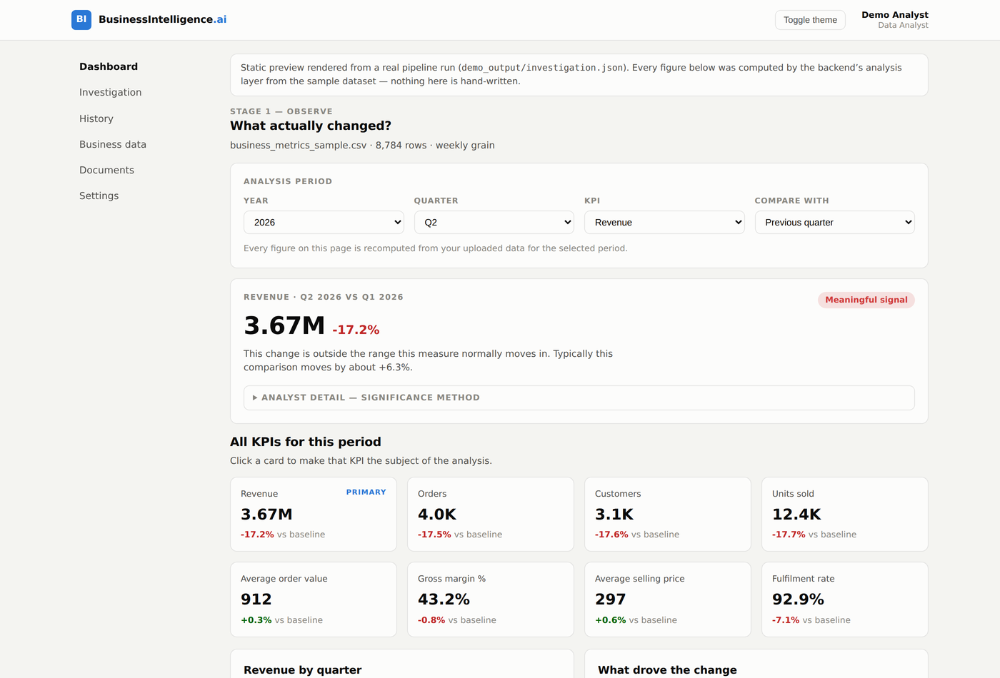
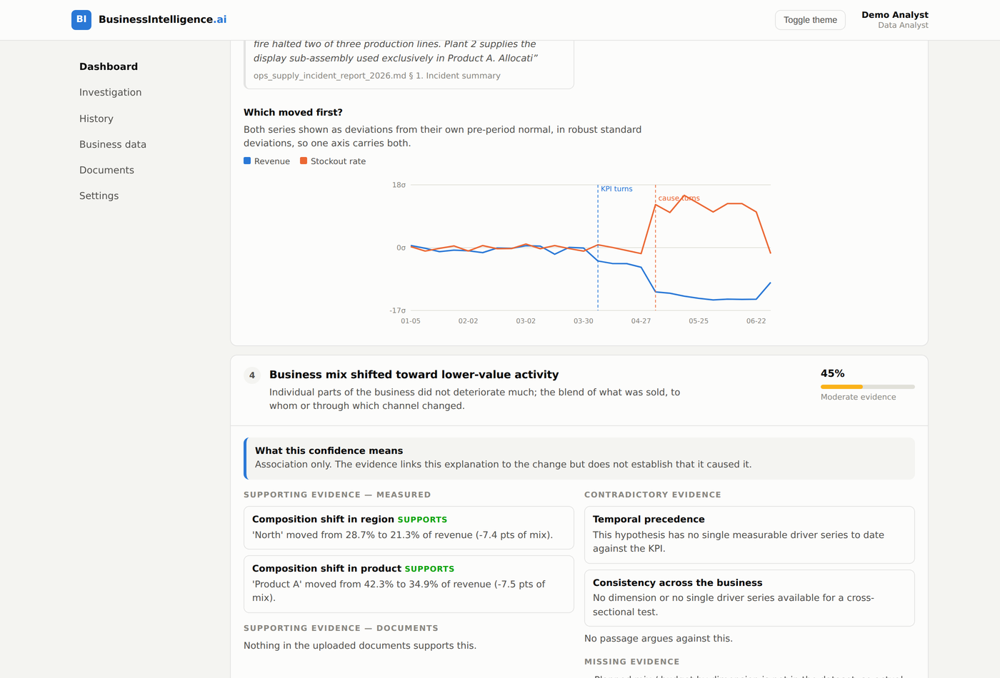
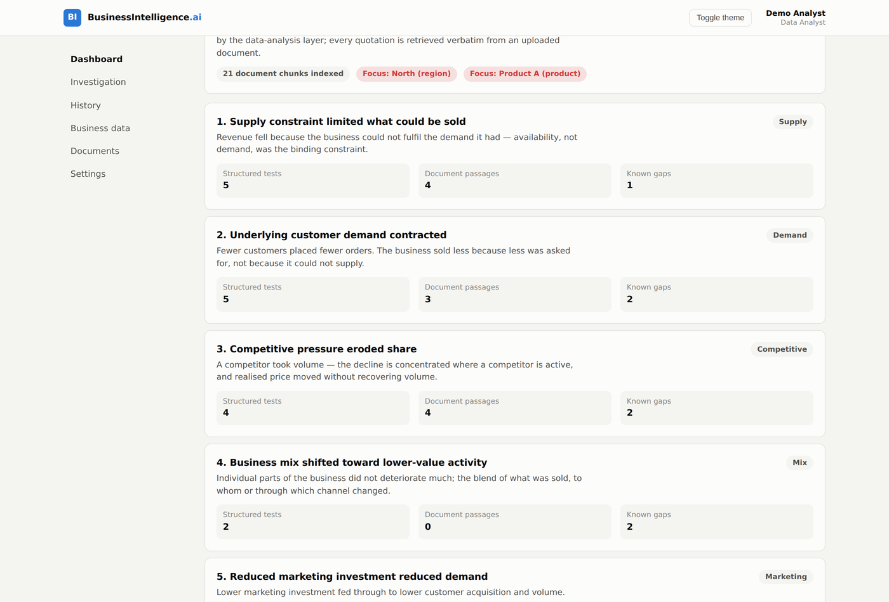
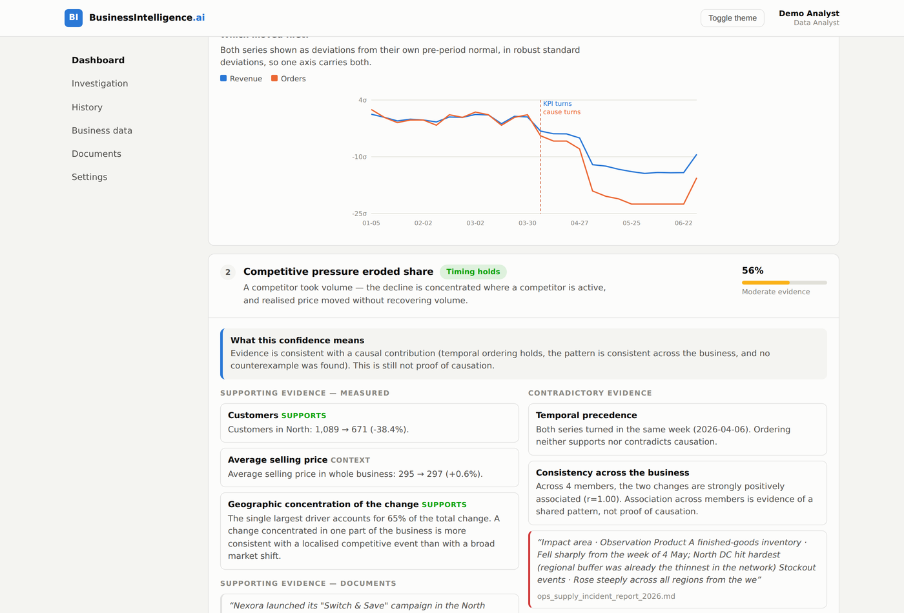
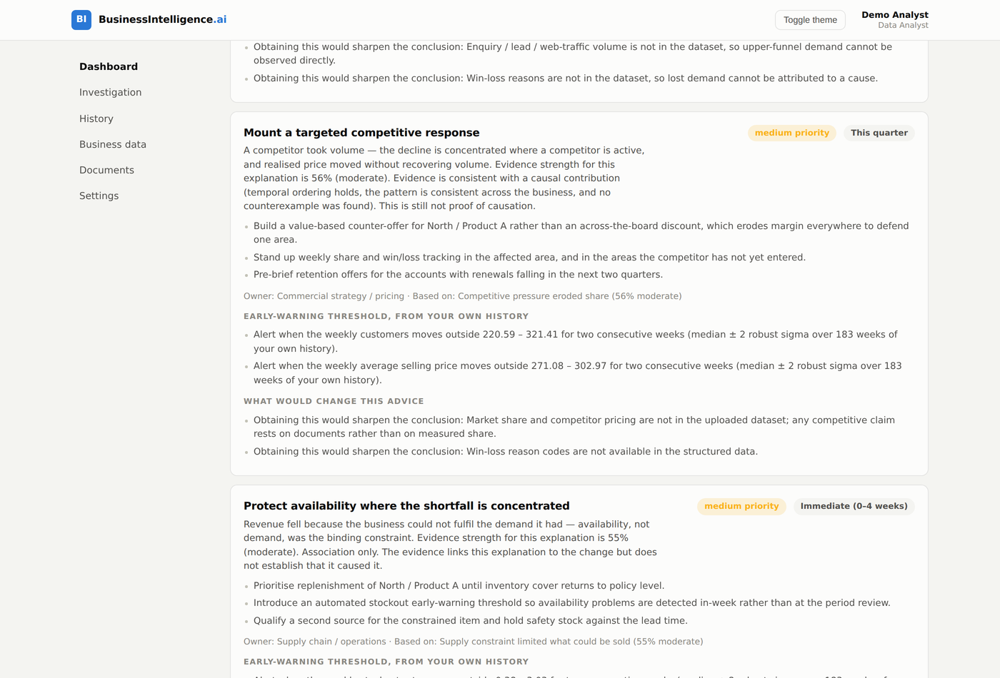
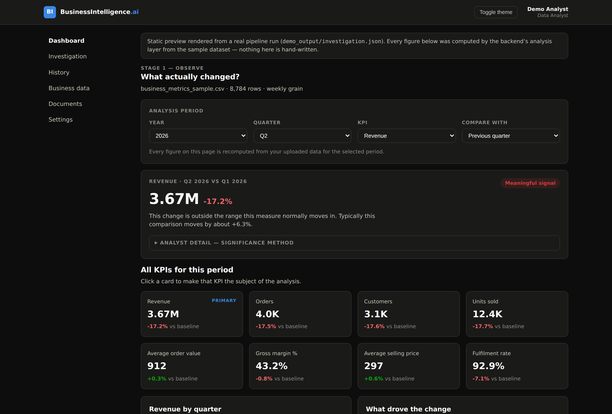

<div align="center">

# BusinessIntelligence.ai

**An evidence-backed KPI storytelling and root-cause investigation system.**

Dashboards tell you *what* happened. This tells you what changed, whether it matters,
what most likely explains it, **what contradicts that explanation**, and what to do next.


`OBSERVE → INVESTIGATE → CONTEST → ACT`

Accenture Innovation Challenge 2026 · Prototype submission

</div>

---

## The problem

A business dashboard is very good at showing that revenue fell 17%. It is not good at
answering the five questions that actually matter:

1. Is that change meaningful, or is it normal variation?
2. Which part of the business actually drove it?
3. What could explain it — and what are the *competing* explanations?
4. Can the leading explanation be trusted, or does something contradict it?
5. What should we do next?

Answering these takes an analyst hours of manual work across dashboards, spreadsheets,
operations reports and customer feedback. Many businesses have no analyst at all. And the
easiest mistake in the world is to accept the first explanation that sounds convincing —
usually the best-documented one, which is not the same as the true one.

## The idea

The product is a four-stage investigation, and the stages are deliberately separate
because each answers a different question.

| Stage | Question | How it is answered |
|---|---|---|
| **OBSERVE** | What actually changed? | Deterministic statistics over the user's own data: robust anomaly detection against the KPI's own history and seasonality, then driver decomposition across every business dimension |
| **INVESTIGATE** | What could explain it? | Competing hypotheses, each one testable, each tested against structured data **and** retrieved passages from the user's documents |
| **CONTEST** | What would disprove it? | Four adversarial checks: temporal precedence, cross-sectional consistency, counterexample search, contradictory retrieval — plus a reverse-causation screen |
| **ACT** | What should we do? | Evidence-linked recommendations, monitoring thresholds derived from the user's own history, and an explicit statement of what would change the advice |

> Investigation asks *"could this be the cause?"*
> Contest asks *"what would disprove it?"*
> Keeping those apart is the whole point.

### The rule that shapes the architecture

> **The LLM proposes and reasons. The data engine calculates. RAG retrieves. Contest challenges.
> The backend orchestrates. The frontend communicates.**

No business number in this product is produced by a language model. KPIs, significance,
driver contributions, correlations, confidence scores and alert thresholds are all computed
by a deterministic pandas/NumPy layer from the user's uploaded rows. The model is given
those facts and is forbidden, in its system prompt, from inventing new ones. The whole
pipeline runs to completion with **no API key at all** — the model improves the prose, not
the analysis.

---

## What it looks like



**The moment that makes the demo.** The operations report documents a supply disruption in
gruelling detail — it is by far the best-evidenced explanation available. Contest dates both
series and finds the revenue decline started **four weeks before the disruption did**:



So supply is capped at "contributing factor", and a less well-documented explanation —
competitive demand erosion, which *did* start first — ranks above it. That is the difference
between a dashboard with an LLM bolted on and an investigation.

| | |
|---|---|
|  |  |
| Competing hypotheses, each with its evidence count | Ranked after being challenged, with confidence bands |
|  |  |
| Recommendations tied to the evidence behind them | Light and dark themes, fully responsive |

**Want to see it without installing anything?** Open [`docs/ui-preview.html`](docs/ui-preview.html)
in a browser. It is a single self-contained file rendered from a real pipeline run — every
number in it came out of the backend.

---

## Quick start

Two terminals. Roughly two minutes. **No Firebase project and no API key are required to run it.**

### 1. Backend

```bash
cd backend
python3 -m venv .venv && source .venv/bin/activate    # Windows: .venv\Scripts\activate
pip install -r requirements.txt
cp .env.example .env
uvicorn app.main:app --reload --port 8000
```

API docs: <http://localhost:8000/docs>

### 2. Frontend

```bash
cd frontend
npm install
cp .env.example .env
npm run dev
```

App: <http://localhost:5173>

### 3. Two minutes to the demo

1. **Create an account** — pick **Data Analyst** to see the statistical layer, or **Business
   Leader** for the decision view. (Without Firebase keys the app uses the backend's demo
   login: enter any email and continue.)
2. **Business data → Load sample company** — 8,784 weekly rows across 14 quarters, four
   dimensions, sixteen metrics.
3. **Documents → Load sample documents** — seven business documents (operations report,
   customer feedback, market intelligence, management commentary, sales review, logistics
   log, pricing note).
4. **Dashboard** — choose **2026 / Q2**. Revenue is −17.2% and flagged as a meaningful signal.
5. **Investigation → Run investigation** — walk the four stages.

Prefer the terminal? `python3 scripts/run_pipeline_demo.py` runs the whole pipeline headless
and prints the result.

---

## Implementation approach

### Structured analysis (the source of truth for numbers)

**Anomaly detection.** The change is scored as a robust z against the distribution of the
KPI's *own* historical period-over-period changes, using median and MAD rather than mean and
standard deviation — the outlier we are hunting must not inflate the yardstick used to detect
it. With enough history the comparison is narrowed to the *same quarter transition* in
previous years, which absorbs seasonality. Small samples are corrected for: sigma is inflated
for sample size and floored against the KPI's all-history dispersion, because three
same-quarter observations can otherwise produce a z-score of −71 and a spurious "extreme
anomaly". A change must be **both** statistically unusual **and** commercially material to be
called a signal.

**Driver decomposition.** Additive KPIs decompose by delta contribution. Ratio KPIs get a
rate/mix decomposition — a margin can fall because every product got worse (rate) or because
the blend shifted toward weaker products (mix), and those are different business problems.
Crucially, each member is also scored by **over-index**: contribution ÷ its own share of the
baseline. A segment that is 60% of the business and contributes 60% of the decline is
arithmetic, not a driver. Only members that move the KPI *more than their size implies* are
promoted to drivers, and that is what scopes the rest of the investigation.

### Hypothesis generation

Ten hypothesis templates (supply, demand, competitive, pricing, mix, channel execution,
service quality, marketing, seasonality, data artefact). A template only enters the
investigation if the uploaded dataset contains the columns needed to test it — **the system
never proposes an explanation it cannot examine**. Each template runs probes that measure real
metrics over the selected and baseline periods, and declares up front what evidence it would
need but does not have.

Every probe declares its predicted direction. If the metric moves the other way the evidence
is automatically **re-labelled as contradicting**: a hypothesis is not permitted to claim
support from a number that points against it.

### Contest — the differentiator

1. **Temporal precedence.** Weekly onset detection for both the KPI and the proposed cause
   (first week outside its own robust band, sustained). A cause that starts after the KPI
   moved cannot be the whole explanation, however strong its supporting evidence — confidence
   is hard-capped at 55% and the reason is shown to the user.
2. **Cross-sectional consistency.** Across dimension members, does the proposed cause move
   with the KPI? Reported as an association with its *r*, and never described as causation.
3. **Counterexample search.** Members where the KPI fell but the proposed cause did not move
   at all — the cleanest contradiction structured data can produce.
4. **Contradictory retrieval.** Queries built to find passages that argue *against* the
   hypothesis, filtered by explicit contradiction markers, and re-classified by the LLM as a
   skeptical reviewer when a key is configured.
5. **Reverse-causation screen.** Some "causes" are arithmetically downstream of the KPI —
   marketing budgeted as a share of revenue, realised price computed from revenue, tickets per
   order rising because orders fell. These correlate beautifully and explain nothing. The
   templates declare the risk; a lead/lag cross-correlation on *differenced* weekly series
   (differenced, so a shared trend cannot manufacture the correlation) tests the direction;
   suspected cases are penalised and capped at 45%.

**Confidence** is `support / (support + against + missing-evidence penalty + prior)`, where
each term is a weighted sum of measured evidence strengths. It is presented as
*evidence-based confidence*, never as a probability, and the full ledger behind every score is
available to analysts. Where two explanations are within 12 points, the system says so
instead of picking one.

### Retrieval

Documents are chunked heading-aware and indexed with BM25 per user. No embedding API key, no
vector service, no cold start — and business evidence retrieval is heavily entity-driven
("North", "Product A", "stockout"), where exact-term matching is a strength. Retrieval
strength is scored **absolutely**, not relative to the best hit for a query: otherwise every
hypothesis would appear to have a perfectly relevant document. The `Retriever` interface is
the only thing the engines touch, so moving to Chroma or PostgreSQL + pgvector is one class.

### Roles (authorisation, not decoration)

Chosen at sign-up, changeable in Settings.

* **Business Leader** — what changed, whether it matters, the leading explanation, the live
  alternative, what remains uncertain, and what to do next.
* **Data Analyst** — all of that plus the significance method and its parameters, full driver
  tables, the evidence ledger behind every confidence score, per-member consistency tables,
  weekly onset charts, and a retrieval inspector.

Analyst-only fields are **removed from the API response** for other roles, not merely hidden
in the interface.

---

## Solution architecture

```
                            ┌────────────────────────────┐
                            │  USER (leader / analyst)   │
                            └─────────────┬──────────────┘
                                          │
                       ┌──────────────────▼───────────────────┐
                       │ FRONTEND — React + Vite + Tailwind   │
                       │ dashboard · timeframe · hypothesis    │
                       │ cards · evidence · reasoning trail    │
                       └──────────────────┬───────────────────┘
                                          │ REST (Firebase ID token)
                       ┌──────────────────▼───────────────────┐
                       │ BACKEND — Python + FastAPI            │
                       │ auth · roles · orchestration · state  │
                       └────┬──────────────┬──────────────┬────┘
                            │              │              │
            ┌───────────────▼──┐  ┌────────▼───────┐  ┌───▼─────────────┐
            │ STRUCTURED       │  │ RAG RETRIEVAL  │  │ LLM REASONING   │
            │ ANALYSIS         │  │ chunk · index  │  │ Anthropic Claude│
            │ pandas / NumPy   │  │ BM25 · cite    │  │ frame · classify│
            │ FACTS            │  │ QUOTES         │  │ · narrate       │
            └───────────────┬──┘  └────────┬───────┘  └───┬─────────────┘
                            └──────────────┼──────────────┘
                                           │
              OBSERVE ──→ INVESTIGATE ──→ CONTEST ──→ ACT
                                           │
                       ┌───────────────────▼──────────────────┐
                       │ DATA STORE — document-shaped          │
                       │ JSON file store (default) ⇄ Mongo Atlas│
                       └───────────────────────────────────────┘
```

Full detail, and the reasoning behind each choice, in **[docs/ARCHITECTURE.md](docs/ARCHITECTURE.md)**.

### Repository layout

```
backend/
  app/
    main.py                 FastAPI application
    config.py               env-driven settings
    deps.py                 auth + role dependencies
    auth/firebase_auth.py   Firebase ID-token verification (+ demo mode)
    db/                     document store: base · json_store · mongo_store · repositories
    engines/
      metrics.py            metric registry, schema detection, aggregation rules
      observe.py            STAGE 1 — significance + driver decomposition
      hypotheses.py         hypothesis library and structured probes
      investigate.py        STAGE 2 — competing hypotheses + evidence
      analysis.py           onset detection, correlation, lead/lag, price-volume split
      contest.py            STAGE 3 — adversarial checks + confidence scoring
      act.py                STAGE 4 — recommendations + monitoring thresholds
    rag/                    extract · chunker · index (BM25) · retriever
    llm/                    Anthropic client + the three role prompts
    api/                    routes: auth · data · analysis · system, and role redaction
    services/               dataset loading, pipeline orchestration
  tests/                    51 tests, no network and no API key required
frontend/
  src/
    pages/                  auth · dashboard · investigation · data · documents · history · settings
    components/             hypothesis cards, evidence panels, charts, confidence meters
    context/                auth (Firebase + role) and theme
    lib/                    api client, firebase, formatting
sample_data/                demo dataset, document corpus, CSV template, format reference
scripts/                    dataset generator, headless pipeline runner, UI preview builder
docs/                       architecture, API contract, Firebase setup, demo script, task board
```

---

## Dependencies

**Backend** (`backend/requirements.txt`) — Python 3.11+
FastAPI · Uvicorn · Pydantic · pandas · NumPy · pypdf · firebase-admin · anthropic ·
pymongo *(only used when `DB_BACKEND=mongo`)* · pytest

**Frontend** (`frontend/package.json`) — Node 18+
React 18 · Vite 5 · Tailwind CSS 3 · Recharts · Firebase JS SDK · React Router · lucide-react

**Optional at runtime.** Firebase credentials, an Anthropic API key and a MongoDB Atlas URI
are each optional; the app degrades explicitly and visibly rather than failing.

---

## Configuration

Every setting has a working default. See `backend/.env.example` and `frontend/.env.example`.

| Variable | Default | Effect |
|---|---|---|
| `DB_BACKEND` | `json` | `json` = local file store · `mongo` = MongoDB Atlas |
| `MONGODB_URI` | — | Set with `DB_BACKEND=mongo` to move to Atlas; no code changes |
| `AUTH_MODE` | `auto` | `firebase` verifies ID tokens · `demo` enables local login · `auto` picks by credentials |
| `FIREBASE_SERVICE_ACCOUNT_JSON` | — | Service-account JSON; enables signature verification |
| `ANTHROPIC_API_KEY` | — | Empty runs the deterministic reasoner; the four stages still complete |
| `ANOMALY_Z_THRESHOLD` | `2.0` | Robust z above which a change is statistically unusual |
| `MIN_MATERIAL_CHANGE_PCT` | `3.0` | Changes below this are never called meaningful |

Firebase setup, step by step: **[docs/FIREBASE_SETUP.md](docs/FIREBASE_SETUP.md)**.
Moving to MongoDB Atlas: **[docs/ARCHITECTURE.md](docs/ARCHITECTURE.md#swapping-the-database)**.

---

## Using your own data

The product analyses **your** data — nothing is hard-coded to the demo company.

Upload one CSV with a `date` column, at least one metric column, and any dimension columns
you have. Unknown text columns become extra dimensions; unknown numeric columns become extra
KPIs. Download the template from the Data page, or read
**[sample_data/DATA_FORMAT.md](sample_data/DATA_FORMAT.md)**.

```csv
date,region,product,channel,segment,revenue,units_sold,orders,customers,fulfilled_orders,stockout_events,inventory_units,cost_of_goods,marketing_spend,returns,support_tickets
2026-01-05,North,Product A,Online,Enterprise,128450.75,482,185,144,185,7,2610,72180.40,11945.90,11,27
```

Then upload whatever written material you have — operations reports, customer feedback,
market notes — and the investigation will quote it, with the document and section shown.

---

## Tests

```bash
cd backend
python3 -m unittest discover -s tests -t .     # or: pytest
```

51 tests, no network access and no API key needed. They cover the parts where being wrong
would be invisible:

* KPI values match a plain pandas `groupby` on the raw file
* ratio KPIs are computed from summed components, not as an average of row-level averages
* driver contributions sum to exactly 100% and driver deltas sum to the total delta
* the planted anomaly is detected — and a *quiet* quarter is **not** flagged
* robust z-scores stay plausible on small same-quarter samples
* an irrelevant retrieval query returns no evidence at all
* the well-documented supply hypothesis has the strongest raw support **and is still capped**,
  because the KPI moved first
* reverse-causation risk is detected and penalised
* no hypothesis ever claims proven causation
* the analyst response contains the evidence ledger and the leader response does not
* one user cannot see another user's data

---

## Honest limits

* This explains the data you upload. A cause that leaves no trace in that data cannot be found.
* Confidence scores measure **evidence strength**, not probability, and do not establish causation.
* Recommendations are decision support for a human owner, not automated decisions.
* BM25 retrieval is lexical: it will miss a document that describes the same event in entirely
  different words. The retriever interface is built so a vector index can replace it.
* The system is a prototype for one convincing end-to-end investigation, not a production BI
  platform for arbitrary enterprise data.

---

## Documentation

| Document | Contents |
|---|---|
| [docs/ARCHITECTURE.md](docs/ARCHITECTURE.md) | Every component, why it exists, and the trade-offs taken |
| [docs/API_CONTRACT.md](docs/API_CONTRACT.md) | Every endpoint with request/response shapes |
| [docs/FIREBASE_SETUP.md](docs/FIREBASE_SETUP.md) | Firebase project setup, step by step |
| [docs/DEMO_SCRIPT.md](docs/DEMO_SCRIPT.md) | A three-minute demo-video script with timings |
| [docs/TASK_BOARD.md](docs/TASK_BOARD.md) | 58 atomic tasks, board-ready |
| [sample_data/DATA_FORMAT.md](sample_data/DATA_FORMAT.md) | Input format reference |
| [docs/ui-preview.html](docs/ui-preview.html) | Self-contained UI preview from a real run |

## Licence

MIT — see [LICENSE](LICENSE).
